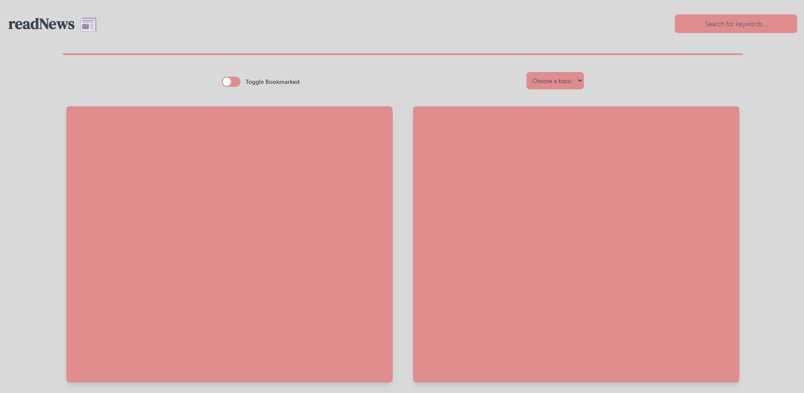
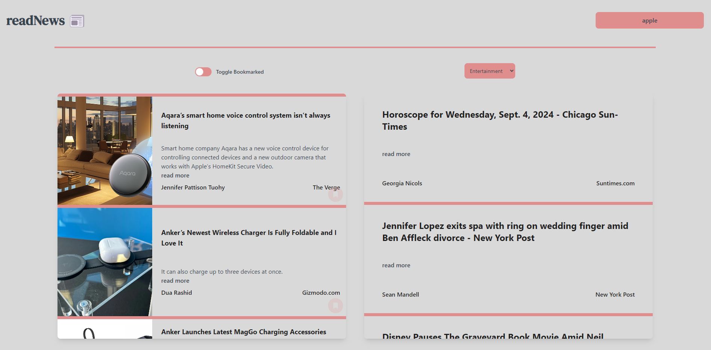
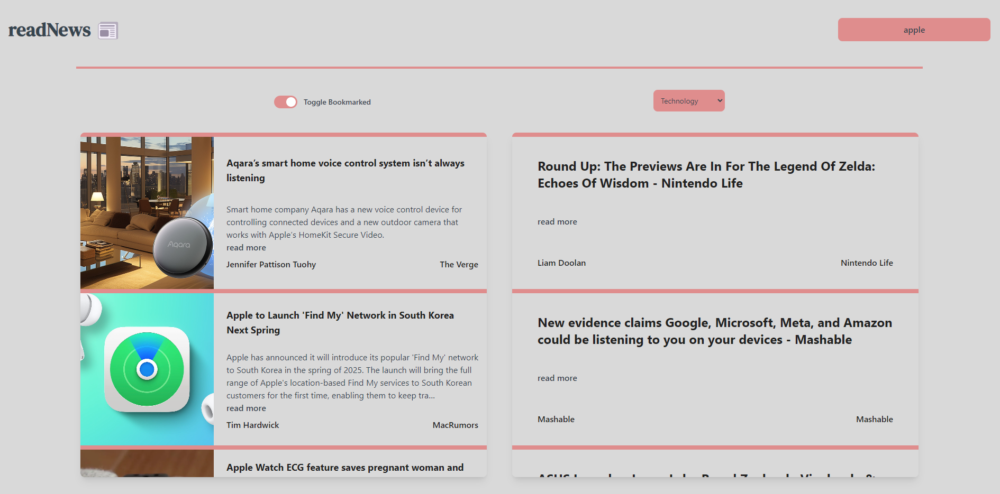

# readNews

𝐫𝐞𝐚𝐝𝐍𝐞𝐰𝐬 is a React app using 𝐍𝐞𝐰𝐬𝐀𝐏𝐈 for fetching news by categories and keywords, with bookmarking and custom key-press functionality. Built with React hooks.

## Screenshots

#### Desktop

##### Desktop-Default



##### Desktop-Search Query



##### Desktop-Bookmarked Articles



## Run Locally

Get the api key from https://newsapi.org/

Clone the project

```bash
  git clone https://github.com/ei-abdullah/readNews.git
```

Go to the readNews directory

```bash
  cd readNews
```

Install dependencies

```bash
  npm install
```

Place api key

```JS
  const API_KEY = "API_KEY here";
```

Start the server

```bash
  npm run dev
```

## Tech Stack

**Client:** React, Tailwind CSS, Javascript, CSS, HMTL

## 🔗 Links

[](https://www.linkedin.com/in/eiabdullah/)
[](https://x.com/blocAbdullah)

## License

[MIT](https://choosealicense.com/licenses/mit/)
